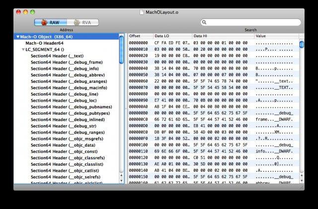
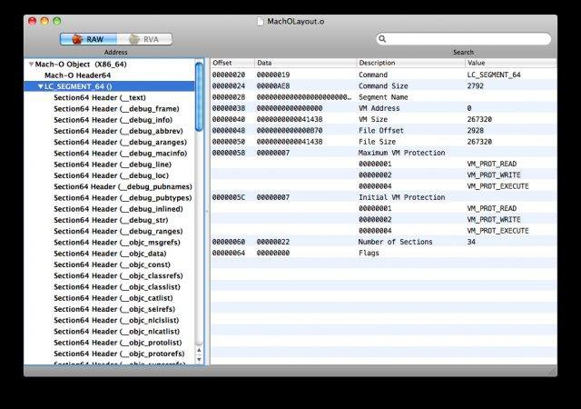

# MachOView

* `MachOView`
  * 是什么：查看和编辑Intel的x86和ARM的`Mach-O`二进制文件的工具
  * 截图
    * 
    * 
  * 资料
    * 最早好像是在sourceforge
      * MachOView download | SourceForge.net
        * https://sourceforge.net/projects/machoview/
    * 后来有人fork到GitHub
      * gdbinit/MachOView: MachOView fork
        * https://github.com/gdbinit/MachOView
    * 现在有国人fork后继续维护
      * fangshufeng/MachOView: 分析Macho必备工具
        * https://github.com/fangshufeng/MachOView
