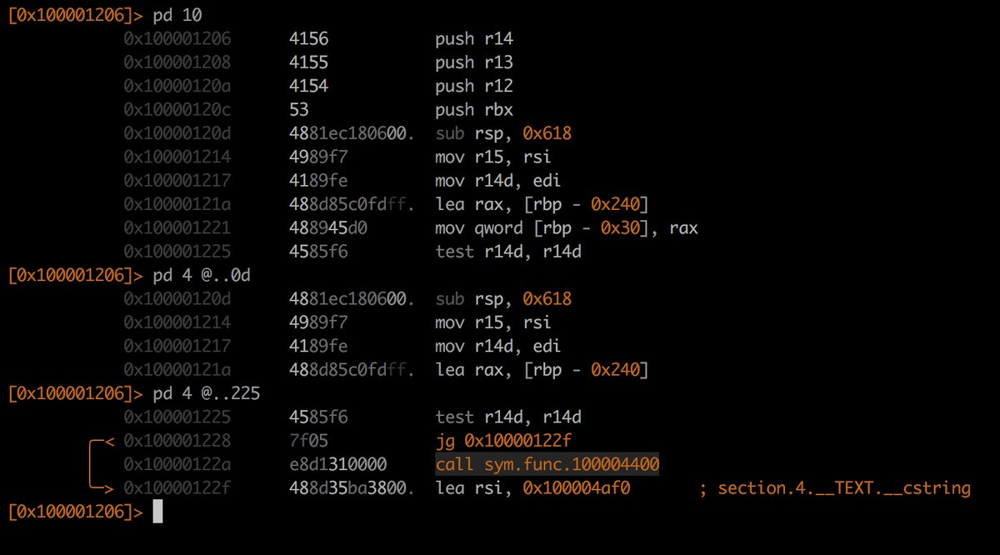
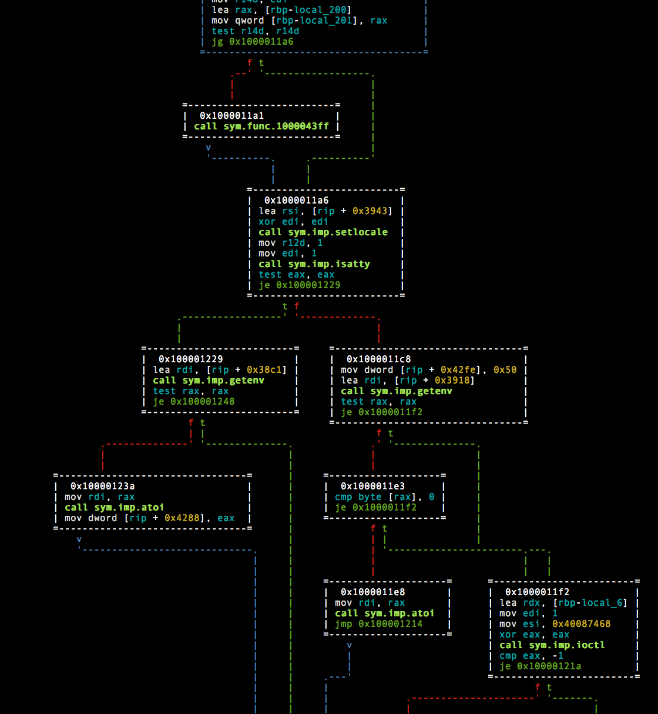
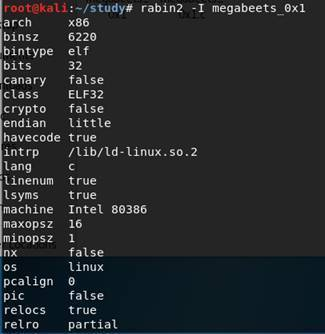

# radare2

* `radare2`
  * 是什么：一个著名的开源逆向工程平台
    * Unix-like reverse engineering framework and commandline tools
  * 评价
    * 可谓是一大神器
      * 支持包括反汇编、分析数据、打补丁、比较数据、搜索、替换、虚拟化等等，同时具备超强的脚本加载能力，并且可以运行在几乎所有主流的平台
  * 竞品
    * `IDA`
  * 截图
    * 
    * 
  * 支持平台
    * Mac
    * Windows
    * Linux
    * Solaris
    * Android
    * iOS
    * Haiku
  * 历史
    * Radare project started as a forensics tool, a scriptable commandline hexadecimal editor able to open disk files
    *  but later support for analyzing binaries, disassembling code, debugging programs, attaching to remote gdb servers
  * 功能：Radare is a portable reversing framework that can
    * Disassemble (and assemble for) many different architectures
    * Debug with local native and remote debuggers (gdb, rap, webui, r2pipe, winedbg, windbg)
    * Run on Linux, *BSD, Windows, OSX, Android, iOS, Solaris and Haiku
    * Perform forensics on filesystems and data carving
    * Be scripted in Python, Javascript, Go and more
    * Support collaborative analysis using the embedded webserver
    * Visualize data structures of several file types
    * Patch programs to uncover new features or fix vulnerabilities
    * Use powerful analysis capabilities to speed up reversing
    * Aid in software exploitation
  * 特性
    * Batch, commandline, visual and panels interactive modes
    * Embedded webserver with js scripting and webui
    * Assemble and disassemble a large list of CPUs
    * Runs on Windows and any other UNIX flavour out there
    * Analyze and emulate code with ESIL
    * Native debugger and GDB, WINDBG, QNX and FRIDA
    * Navigate ascii-art control flow graphs
    * Ability to patch binaries, modify code or data
    * Search for patterns, magic headers, function signatures
    * Easy to extend and modify
    * Commandline, C API, script with r2pipe in any language
  * 包含工具
    * `rabin2`: 
      * 获取`ELF`, `PE`, `Mach-O`, `Java CLASS`文件的区段、头信息、导入导出表、字符串相关、入口点等等
        * 包括打印出二进制文件的系统属性、语言、字节序、框架、以及使用了哪些加固技术
      * 支持多种格式的输出文件
      * 截图
        * 
    * `radiff2`: 比较文件不同的
    * `rahash2`: 各种密码算法，hash算法集成
    * `rasm2`: 汇编和反汇编
    * `ragg2`: 开发shellcode工具(radare2自己编写的编译器)
    * `radare2`: 整合了所有工具
  * 资料
    * 官网
      * radare
        * https://rada.re/n/radare2.html
    * GitHub
      * radareorg/radare2: UNIX-like reverse engineering framework and command-line toolset
        * https://github.com/radareorg/radare2
    * 教程
      * The Official Radare2 Book
        * https://book.rada.re/index.html

## help帮助语法

```bash
$ radare2 -h
Usage: r2 [-ACdfLMnNqStuvwzX] [-P patch] [-p prj] [-a arch] [-b bits] [-i file]
          [-s addr] [-B baddr] [-m maddr] [-c cmd] [-e k=v] file|pid|-|--|=
 --           run radare2 without opening any file
 -            same as 'r2 malloc://512'
 =            read file from stdin (use -i and -c to run cmds)
 -=           perform !=! command to run all commands remotely
 -0           print \x00 after init and every command
 -2           close stderr file descriptor (silent warning messages)
 -a [arch]    set asm.arch
 -A           run 'aaa' command to analyze all referenced code
 -b [bits]    set asm.bits
 -B [baddr]   set base address for PIE binaries
 -c 'cmd..'   execute radare command
 -C           file is host:port (alias for -c+=http://%s/cmd/)
 -d           debug the executable 'file' or running process 'pid'
 -D [backend] enable debug mode (e cfg.debug=true)
 -e k=v       evaluate config var
 -f           block size = file size
 -F [binplug] force to use that rbin plugin
 -h, -hh      show help message, -hh for long
 -H ([var])   display variable
 -i [file]    run script file
 -I [file]    run script file before the file is opened
 -k [OS/kern] set asm.os (linux, macos, w32, netbsd, ...)
 -l [lib]     load plugin file
 -L           list supported IO plugins
 -m [addr]    map file at given address (loadaddr)
 -M           do not demangle symbol names
 -n, -nn      do not load RBin info (-nn only load bin structures)
 -N           do not load user settings and scripts
 -q           quiet mode (no prompt) and quit after -i
 -Q           quiet mode (no prompt) and quit faster (quickLeak=true)
 -p [prj]     use project, list if no arg, load if no file
 -P [file]    apply rapatch file and quit
 -r [rarun2]  specify rarun2 profile to load (same as -e dbg.profile=X)
 -R [rr2rule] specify custom rarun2 directive
 -s [addr]    initial seek
 -S           start r2 in sandbox mode
 -t           load rabin2 info in thread
 -u           set bin.filter=false to get raw sym/sec/cls names
 -v, -V       show radare2 version (-V show lib versions)
 -w           open file in write mode
 -x           open without exec-flag (asm.emu will not work), See io.exec
 -X           same as -e bin.usextr=false (useful for dyldcache)
 -z, -zz      do not load strings or load them even in raw
```

## R2Pipe

* `R2Pipe`
  * 是什么：`R2Pipe`是一个可以调用`radare2`的`Python`脚本库
  * 示例代码
    * https://github.com/radareorg/radare2-r2pipe/tree/master/python/examples

