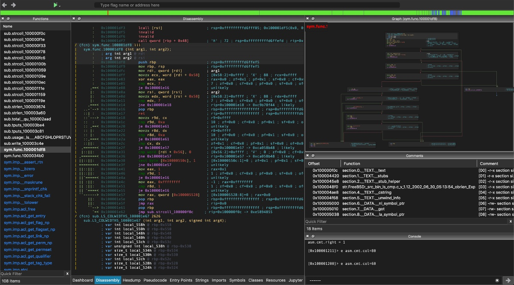
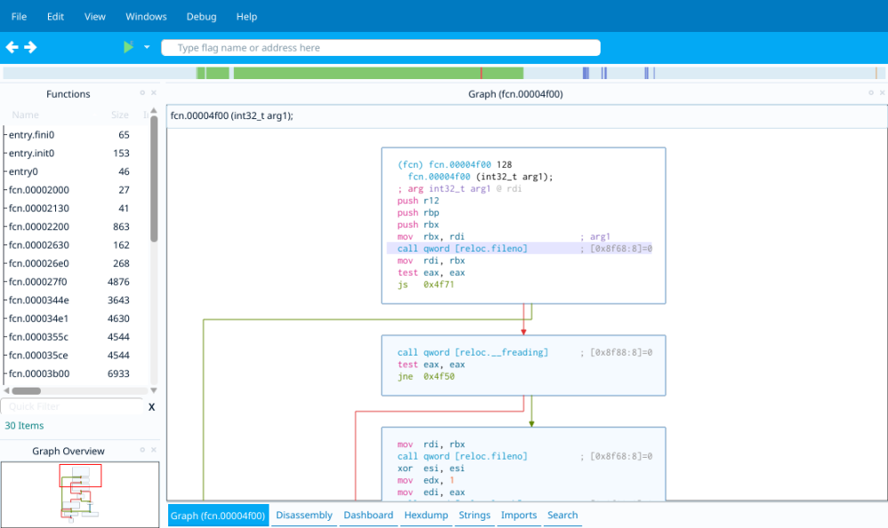

# Cutter

* `Cutter`
  * 一句话描述：radare2的GUI版本
    * Free and Open Source RE Platform powered by radare2
    * Cutter is the official UI for radare2 for Linux, macOS and Windows, it's written in C++ and uses the Qt
  * 支持多平台
    * `Linux`
    * `Mac`
    * `Windows`
  * 实现细节
    * `C++`语言写的
    * 前端：`QT`
  * 截图
    * 
    * 
  * 特点
    * 内置Ghidra decompiler
      * 无需额外安装Java
  * 核心功能和特点
    * 开源 Open Source
      * Completely FREE and licensed under GPLv3
    * Decompiler
      * Native integration of Ghidra's decompiler in Cutter releases
    * Graph View
      * Fully featured graph view as well as mini-graph for fast navigation
    * Debugger
      * Multiplatform native and remote debugger for dynamic analysis
    * Disassembly
      * Linear disassembly view
    * Hex Editor
      * View and modify any file with a rich and powerful Hex View
    * Python Scripting Engine
      * Quickly write python scripts to automate tasks
    * Plugins
      * Use Native or Python plugins to extend Cutter's core functionality
    * Binary Patching
      * Add, remove and modify bytes and instructions
    * Emulation
      * Great for automation, crypto algorithms and malware analysis
    * Theme Editor
      * Fully featured theme editor for easy and user-friendly customization of Cutter
    * Modern & Customizable UI
      * Built using Qt C++ and design best practices
    * Integrated Radare2 Console
    * Multi Language
    * Binary Searching
    * Types & Structs
    * Syntax Highlighting
    * STDIO Redirection
    * Remote Debugging
    * Kernel Debug
    * Graph Overview
  * 资料
    * 官网
      * Cutter
        * https://rada.re/n/cutter.html
      * Cutter
        * https://cutter.re
    * GitHub
      * radareorg/cutter: Free and Open Source Reverse Engineering Platform powered by radare2
        * https://github.com/radareorg/cutter