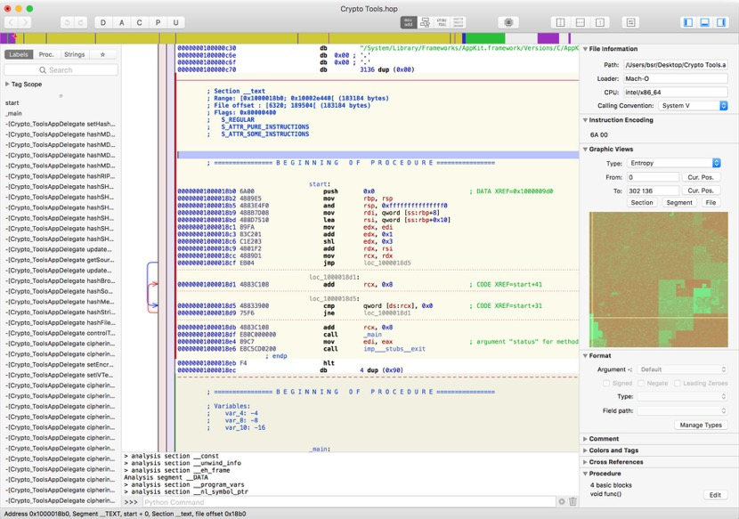
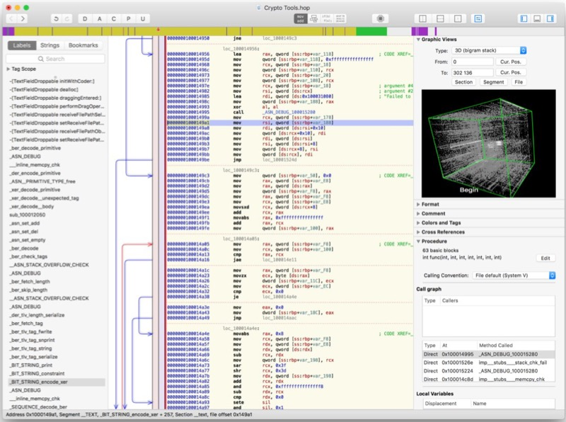
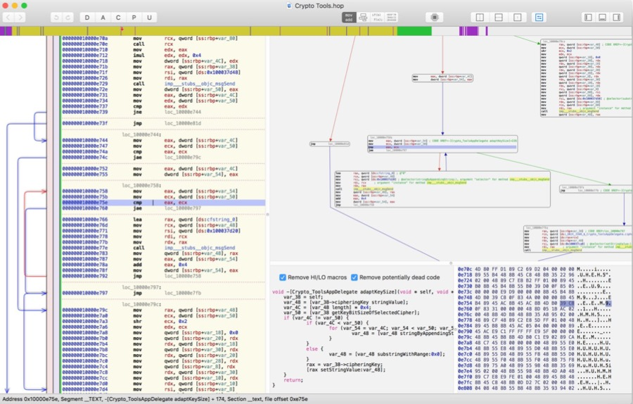

# Hopper Disassembler

* Hopper Disassemble
  * =`Hopper`=`hd`
  * 是什么：Hopper is a reverse engineering tool for OS X and Linux
  * 一句话描述：
    * the reverse engineering tool that lets you disassemble, decompile and debug your applications
  * 功能：disassemble, and decompile
  * 支持平台、架构：32/64bits Intel Mac, Linux, Windows and iOS executables
  * 详解
    * This tool will let you disassemble any binary you want, and provide you all the information about its content, like imported symbols, or the control flow graph! Hopper can retrieve procedural information about the disassembled code like the stack variables, and lets you name all the objects you want.
  * 主要用于：static binary analyses
  * 官网
    * https://www.hopperapp.com
  * 截图
    * 
    * 
    * 
* 对比：
  * Hopper vs IDA
    * 平台支持
      * Hopper：更倾向于`Mac`
      * IDA：支持多平台：`Windows`、`Linux`、`Mac`
