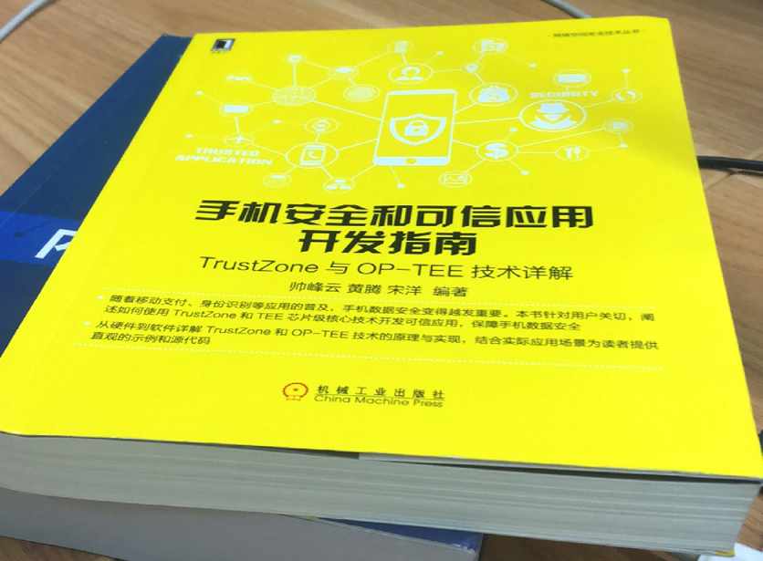

# 信息存储安全

* 信息存储安全
  * 应用场景和领域
    * 生物特征数据存储
      * 指纹
      * 虹膜
    * 信用卡PIN码（保存）
    * 私有密码（存储）
    * 客户数据（存储）
    * 受`DRM`=`Digital Rights Management`=`数字版权管理`保护的媒体
  * 相关书籍
    * 《手机安全和可信应用开发指南》 TrustZone与OP-TEE技术详解
      * 
  * 相关技术
    * 硬件层面
      * `TrustZone`
    * 软件层面
      * `TEE`
