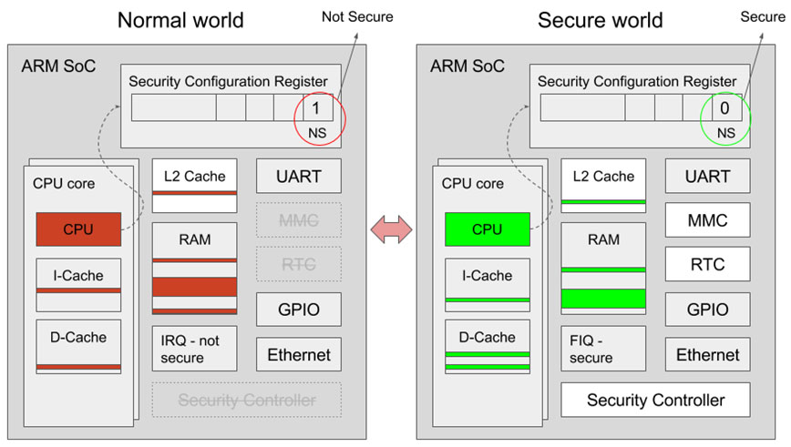
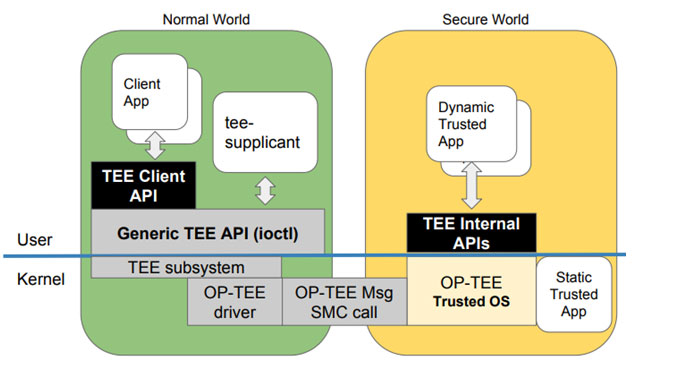
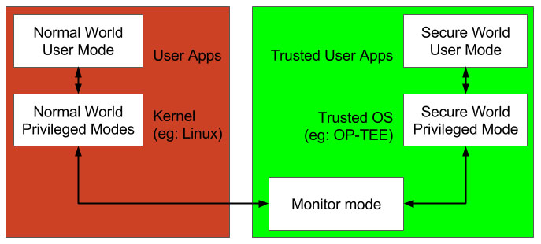

# TEE

* `TEE`=`OP-TEE`
  * 名称
    * `TEE`=`Trusted Execution Environment`=`信任执行环境`=`可信任执行环境`
    * `OP-TEE`=`Open Portable Trusted Execution Environment`=`Open-Source Portable Trusted Execution Environment`=`开放可移植的可信任执行环境`
  * 一句话描述
    * 基于TrustZone技术搭建的安全执行环境
      * designed as companion to a non-secure Linux kernel running on Arm
        * 注：Cortex-A cores using the TrustZone technology
  * 用途=目的=为什么
    * 为了更安全
      * 处理那些需要和安全密切相关的、需要保密处理的信息
  * 历史
      * 最早是ST-Ericsson开发的
        * http://www.stericsson.com/
      * 2013年，ST-Ericsson实现了兼容`GlobalPlatform`
        * https://globalplatform.org/
      * 2013年之后，ST和Ericsson分开了
      * 现在TEE属于STMicroelectronics
          * https://www.st.com/content/st_com/en.html
      * 2013年后期，Linaro成立了`SWG`=`Security Working Group`=`安全工作组`
        * 其最重要的任务之一就是继续开发TEE
      * 在开源TEE之前，花了很多个月去把之前部分私有模块，换成开源实现
        * 包括：密码库, 安全监控, 编译系统及其他
      * 2014-06-12，TEE开源了，叫做OP-TEE
        * 目前现状主要是：
          * 项目属于STMicroelectronics
          * 但是Linaro和STMicroelectronics联合在开发
      * 2015年，项目所有权从STMicroelectronics转给Linaro了
  * 资料
    * 官网
      * https://www.op-tee.org
    * GitHub
      * OP-TEE/optee_os: Trusted side of the TEE
        * https://github.com/OP-TEE/optee_os
    * 技术文档
      * OP-TEE Documentation — OP-TEE documentation documentation
          * http://optee.readthedocs.io
  * 主要设计目标
    * Isolation
      * the TEE provides isolation from the non-secure OS and protects the loaded Trusted Applications (TAs) from each other using underlying hardware support,
    * Small footprint
      * the TEE should remain small enough to reside in a reasonable amount of on-chip memory as found on Arm based systems
    * Portability
      * the TEE aims at being easily pluggable to different architectures and available HW and has to support various setups such as multiple client OSes or multiple TEEs.
  * `OP-TEE`包含内容
    * `Secure world` OS=`optee_os`
      * 现有实现：
        * `OP-TEE OS`, `Trusty`, 高通的`QSEE`, `SierraTEE`
          * 注：所有方案的外部接口都会遵循`GP`=`Global Platform`标准
      * 对比：Normal world os
          * 普通操作系统：Linux、Android等
      * 问：各家厂商和组织的`TEE OS`到底有何区别?
          * 答：`TA`的添加和加载时的校验有所区别
      * 系统架构
        * 
        * 
        * 
      * 相关概念
        * `TA`=`Trusted Application`=可信应用
        * `CA`=`Client Application`=客户端应用
      * 原理
        * 产品开发团队负责开发一个运行在`Linux`上的`CA`和一个运行在`OP-TEE`上的`TA`
        * `CA`使用`TEE client API`与`TA`通信，并且从`TA`获取安全服务
        * `CA`和`TA`使用`共享内存`进行通信
      * 运行机制
        * 当处于`secure world`状态，那么就会执行`TEE OS`部分的代码
        * 当处于`non-secure world`状态时,就执行`linux kernel`部分的代码
    * `Normal world` client=`optee_client`
    * test suite = `optee_test/xtest`
    * linux驱动
  * 常见问题
    * Linux内核
      * Linux内核能直接访问TEE部分的资源吗?
        * Linux kernel不能直接访问TEE部分的资源
      * Linux 内核如何才能访问TEE部分的资源呢?
        * Linux kernel能通过特定的`TA`和`CA`来访问TEE部分特定的资源
