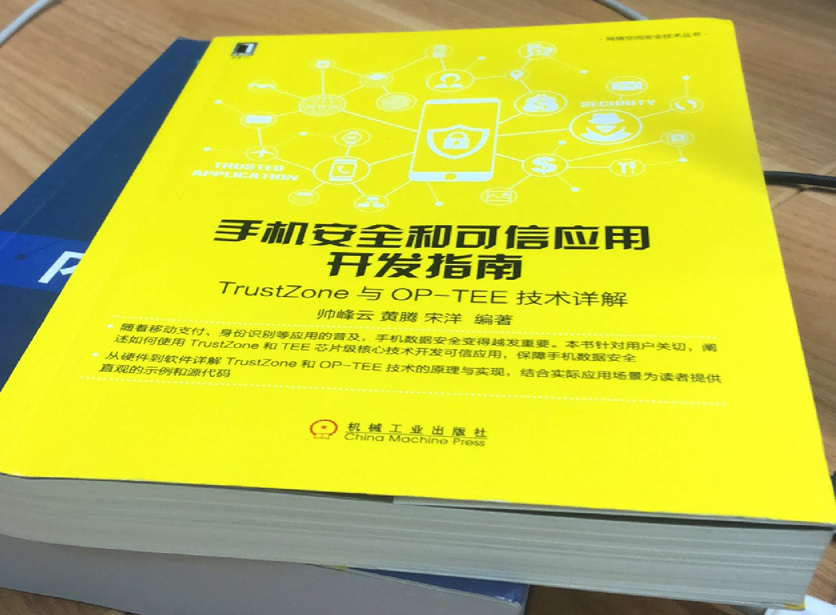
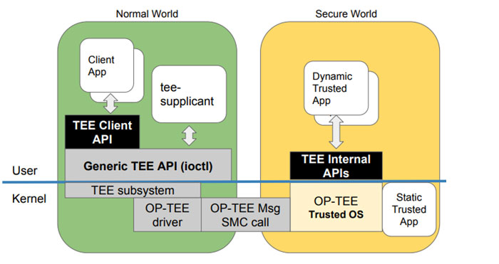

# 概览

## 背景

先说说写这个教程的背景：

* 之前已写过 安卓安全和破解 的教程
    * https://github.com/crifan/android_app_security_crack
        * 目前点赞不少 500+个star
        * 看来大家比较关注这个领域
* 自己计划从事`计算机安全领域`
    * 之前是小白，没这方面的经验
    * 打算边自学，边总结，总结到这个教程中
        * 供自己和他人参考

## 信息安全技术概览

此处对于信息安全相关技术进行概述。

信息安全技术概念包含内容较多，且涉及维度较广，下面以不同维度来阐述，常见分类和对应内容。

* 信息安全
  * 存储安全
    * 应用场景和领域
      * 指纹识别
      * 信用卡PIN码
    * 相关书籍
      * 《手机安全和可信应用开发指南》 TrustZone与OP-TEE技术详解
        * 
    * 相关技术
      * 硬件层面
        * `Trust-Zone`
          * ARM
            * 提出了TrustZone技术
              * 为了确保数据安全
              * 用一根安全总线（称为NS位）来判断当前处于secure world还是non-secure world状态
                * 状态的切换由ATF(arm trusted firmware)来完成
      * 软件层面
        * `TEE`=`OP-TEE`
          * 名称
            * `TEE`=`Trusted Execution Environment`=`信任执行环境`=`可信任执行环境`
            * `OP-TEE`=`Open Portable Trusted Execution Environment`=`Open-Source Portable Trusted Execution Environment`=`开放可移植的可信任执行环境`
          * 一句话描述
            * 基于TrustZone技术搭建的安全执行环境
              * designed as companion to a non-secure Linux kernel running on Arm
                  * 注：Cortex-A cores using the TrustZone technology
          * 用途=目的=为什么
            * 为了更安全
              * 处理那些需要和安全密切相关的、需要保密处理的信息
          * 典型应用举例
            * 信用卡PIN码
            * 私有密码
            * 客户数据
            * 受DRM (Digital Rights Management,数字版权管理)保护的媒体
            * 保护指纹虹膜的生物特征数据
          * 历史
              * 最早是ST-Ericsson开发的
                  * http://www.stericsson.com/
              * 2013年，ST-Ericsson实现了兼容GlobalPlatform
                  * https://globalplatform.org/
              * 2013年之后，ST和Ericsson分开了
              * 现在TEE属于STMicroelectronics
                  * https://www.st.com/content/st_com/en.html
              * 2013年后期，Linaro成立了SWG=Security Working Group=安全工作组
                  * 其最重要的任务之一就是继续开发TEE
              * 在开源TEE之前，花了很多个月去把之前部分私有模块，换成开源实现
                  * 包括：密码库, 安全监控, 编译系统及其他
              * 2014-06-12，TEE开源了，叫做OP-TEE
                  * 目前现状主要是：
                      * 项目属于STMicroelectronics
                      * 但是Linaro和STMicroelectronics联合在开发
              * 2015年，项目所有权从STMicroelectronics转给Linaro了
          * 资料
              * 官网
                  * https://www.op-tee.org
              * GitHub
                  * OP-TEE/optee_os: Trusted side of the TEE
                      * https://github.com/OP-TEE/optee_os
              * 技术文档
                  * OP-TEE Documentation — OP-TEE documentation documentation
                      * http://optee.readthedocs.io
          * 主要设计目标
              * Isolation
                  * the TEE provides isolation from the non-secure OS and protects the loaded Trusted Applications (TAs) from each other using underlying hardware support,
              * Small footprint
                  * the TEE should remain small enough to reside in a reasonable amount of on-chip memory as found on Arm based systems,
              * Portability
                  * the TEE aims at being easily pluggable to different architectures and available HW and has to support various setups such as multiple client OSes or multiple TEEs.
          * `OP-TEE`包含内容
            * Secure world OS=`optee_os`
              * Secure world OS的现有实现：
                * `OP-TEE OS`, `Trusty`, 高通的`QSEE`, `SierraTEE`
                  * 注：所有方案的外部接口都会遵循`GP`=`Global Platform`标准
                * 对比：Normal world os
                  * 普通操作系统：Linux、Android等
                * 问：各家厂商和组织的`TEE OS`到底有何区别?
                  * 答：`TA`的添加和加载时的校验有所区别
              * 系统架构
                  * 
                  * 
                  * 
              * 相关概念
                * `TA`=`Trusted Application`=可信应用
                * `CA`=`Client Application`=客户端应用
              * 原理
                  * 产品开发团队负责开发一个运行在linux上的client application(CA)和一个运行在OP-TEE上的trusted application(TA),CA使用TEE client API与TA通信,并且从TA获取安全服务。
                  * CA和TA使用共享内存进行通信。
              * 运行机制
                  * 当处于`secure world`状态，那么就会执行`TEE OS`部分的代码
                  * 当处于`non-secure world`状态时,就执行`linux kernel`部分的代码
            * normal world client=`optee_client`
            * test suite = `optee_test/xtest`
            * linux驱动
          * 常见问题
            * Linux内核
                * Linux内核能直接访问TEE部分的资源吗?
                    * Linux kernel不能直接访问TEE部分的资源
                * Linux 内核如何才能访问TEE部分的资源呢?
                    * Linux kernel能通过特定的`TA`和`CA`来访问TEE部分特定的资源
