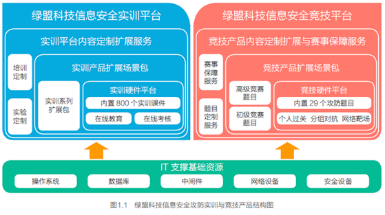
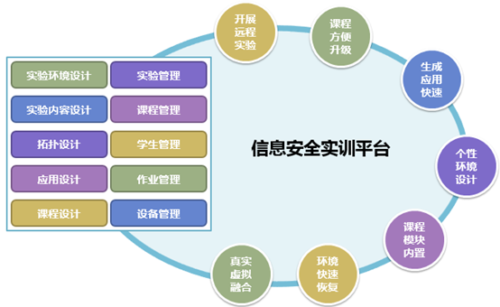
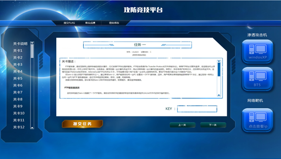
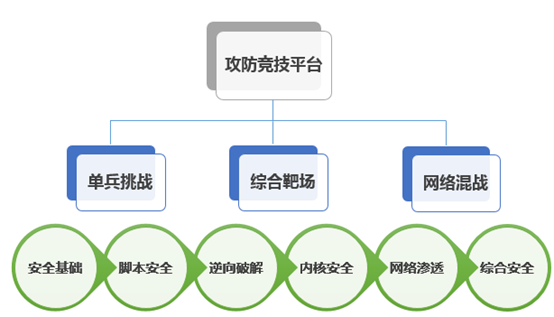

# CTF比赛

TODO：

继续看完：

Getting Started - CTF Wiki

https://ctf-wiki.github.io/ctf-wiki/

并整理过来。

---

* CTF比赛
  * =夺旗赛
    * =CTF=`Capture The Flag`
  * 是什么：一个比赛
    * 在网络安全领域中指的是网络安全技术人员之间进行技术竞技的一种比赛形式
  * 起源：
    * 1996年DEFCON全球黑客大会，以代替之前黑客们通过互相发起真实攻击进行技术比拼的方式。发展至今，已经成为全球范围网络安全圈流行的竞赛形式
    * 2013年全球举办了超过五十场国际性CTF赛事。而DEFCON作为CTF赛制的发源地，DEFCON CTF也成为了目前全球最高技术水平和影响力的CTF竞赛，类似于CTF赛场中的"世界杯"
  * 竞赛模式
    * 解题模式
      * 在解题模式CTF赛制中，参赛队伍可以通过互联网或者现场网络参与，这种模式的CTF竞赛与ACM编程竞赛、信息学奥赛比较类似，以解决网络安全技术挑战题目的分值和时间来排名，通常用于在线选拔赛。题目主要包含逆向、漏洞挖掘与利用、Web渗透、密码、取证、隐写、安全编程等类别
      * 大多数为线上比赛，选手自由组队（人数不受限制），出题者把一些信息安全实战中可能遇到的问题抽象成一个题目，比如一个存在漏洞的网站让选手入侵，一个有漏洞的程序让选手分析来写出漏洞利用程序，一段密文让选手解密，一个图片选手你从里面找出隐藏的线索等等。在完成这些出题的题目后，可以获得一串奇怪的字符串，也就是所谓的flag，提交它，就能获得这道题目的分数
    * 攻防模式=Attack-Defense
      * 在攻防模式CTF赛制中，参赛队伍在网络空间互相进行攻击和防守，挖掘网络服务漏洞并攻击对手服务来得分，修补自身服务漏洞进行防御来避免丢分。攻防模式CTF赛制可以实时通过得分反映出比赛情况，最终也以得分直接分出胜负，是一种竞争激烈，具有很强观赏性和高度透明性的网络安全赛制。在这种赛制中，不仅仅是比参赛队员的智力和技术，也比体力（因为比赛一般都会持续48小时及以上），同时也比团队之间的分工配合与合作。
      * 大多数为线下比赛，参赛队伍人数有限制（通常为3到5人不等），参赛队伍保护自己的服务器，攻击其他队伍的服务器，每个队伍的服务器开始拥有相同的配置和缺陷，比如几个有漏洞的二进制程序、有漏洞的Web应用、某些权限账户弱口令等等，然后队员需要找出这些漏洞并进行加固，同时利用这些漏洞来攻击别人的服务器，拿到其他队伍的权限后，会获取到相应flag后提交，从对方身上赚取相应的分数，每隔一段时间后，可以再次攻击并利用未加固的漏洞获取flag并赚取分数
    * 混合模式=mix
      * 结合了解题模式与攻防模式的CTF赛制，比如参赛队伍通过解题可以获取一些初始分数，然后通过攻防对抗进行得分增减的零和游戏，最终以得分高低分出胜负。采用混合模式CTF赛制的典型代表如iCTF国际CTF竞赛。
      * 解题模式和攻防模式同时进行，解题模式可能会根据比赛的时间、进度等因素来释放需解答的题目，题目的难度越大，解答完成后获取的分数越高；攻防模式会贯穿整个CTF比赛的始终，参赛队伍需不断积累分数，最终参数队伍的名次由两种模式累积的分数总和决定。有些有趣的CTF比赛，还会引入一些情景剧情和现场观众的互动，来增加比赛的趣味性
  * 题目类别
    * WEB=网络安全
      * WEB是CTF竞赛的主要题型，题目涉及到许多常见的WEB漏洞，诸如XSS、文件包含、代码执行、上传漏洞、SQL注入。也有一些简单的关于网络基础知识的考察，例如返回包、TCP-IP、数据包内容和构造。可以说题目环境比较接近真实环境。
      * 所需知识：PHP、python、TCP-IP、SQL
    * MISC=安全杂项
      * MISC即安全杂项，题目涉及隐写术、流量分析、电子取证、人肉搜索、数据分析、大数据统计等等，覆盖面比较广，主要考查参赛选手的各种基础综合知识。
      * 所需知识：常见`隐写术工具`、`wireshark`等`流量审查工具`、编码知识。
    * Crypto=密码学
      * 题目考察各种加解密技术，包括古典加密技术、现代加密技术甚至出题者自创加密技术，以及一些常见编码解码，主要考查参赛选手密码学相关知识点。通常也会和其他题目相结合。
      * 所需知识：矩阵、数论、古典密码学
    * Reverse=逆向工程
      * 题目涉及到软件逆向、破解技术等，要求有较强的反汇编、反编译扎实功底。主要考查参赛选手的逆向分析能力。
      * 所需知识：汇编语言、加密与解密、常见反编译工具
    * PPC=编程类题目
      * 题目涉及到程序编写、编程算法实现，当然PPC相比ACM来说，还是较为容易的。至于编程语言嘛，推荐使用Python来尝试。题目较少，一般与其他类型相结合。
      * 所需知识：基本编程思路、C,C++,Python,php皆可
    * PWN=二进制安全
      * PWN在黑客俚语中代表着攻破，取得权限，在CTF比赛中它代表着溢出类的题目，其中常见类型溢出漏洞有栈溢出、堆溢出。主要考察参数选手对漏洞的利用能力。
        * 所需知识：C，OD+IDA，数据结构，操作系统
  * 基础知识
    * 语言运用
      * 计算机语言可以大致分为机器语言，汇编语言，高级语言，计算机每进行的一次动作，一个步骤，都是按照计算机语言编好的程序来执行。而在CTF比赛中，计算机语言的了解与掌握会有事半功倍的效果，进程的动态调试、防护脚本的编写、源代码审计等工作都是建立在对计算机语言有所掌握的基础上进行的。
      * Web安全
        * 目前国内大多数CTF比赛都以Web安全为主，但是Web安全涉及的内容非常广泛，就典型的Web服务来说，其安全问题可能来自于Web服务器、数据库、Web程序本身与开发语言等。了解一个Web应用的组成架构、装载与配置、指令操作及组件缺陷，是参赛者知识储备环节中不可或缺的部分。
      * 安全加固
        * 安全领域的精髓在于攻防，在CTF比赛也是同样的道理，比赛成绩不仅取决于在有效的时间内拿下多少flag，还取决于能抵御多少次外来攻击。有一些比赛队伍不注重或者不善于漏洞加固，即使得到很多分数，但是优势还是会被慢慢的蚕食掉。所以，了解漏洞的产生原因、减小漏洞的影响范围以及行之有效的安全加固也是一个成功队伍的重要能力。
      * 密码算法
        * 参赛者需要了解主流的密码算法，如对称密码、公钥密码、流密码、哈希密码算法等。在不断的攻防对抗中，一些关键信息或者突破口，往往会通过算法的加解密将它们“隐藏”起来增加解题难度。此外还会伴随着弱口令尝试，密码字典的暴力猜解等。
      * 网络取证
        * 对于网络攻击行为的溯源分析、漏洞挖掘过程中的抓包分析往往是很多参赛队伍在攻防对抗中忽略的问题，能够在最短的时间内抓到线索并做出行之有效的响应，这方面的能力也就成为了高手和顶尖高手之间的分水岭，古人常说：“天下大事，必作于细；天下难事，必成于易”，我想应该就是这个道理

## CTF赛事

* 国外
  * DEFCON CTF：CTF赛事中的“世界杯”
  * UCSB iCTF：来自UCSB的面向世界高校的CTF
  * Plaid CTF：包揽多项赛事冠军的CMU的PPP团队举办的在线解题赛
  * Boston Key Party：近年来崛起的在线解题赛
  * Codegate CTF：韩国首尔“大奖赛”，冠军奖金3000万韩元
  * Secuinside CTF：韩国首尔“大奖赛”，冠军奖金3000万韩元
  * XXC3 CTF：欧洲历史最悠久CCC黑客大会举办的CTF
  * SIGINT CTF：德国CCCAC协会另一场解题模式竞赛
  * Hack.lu CTF：卢森堡黑客会议同期举办的CTF
  * EBCTF：荷兰老牌强队Eindbazen组织的在线解题赛
  * Ghost in the Shellcode：由Marauders和Men in Black Hats共同组织的在线解题赛
  * RwthCTF：由德国0ldEur0pe组织的在线攻防赛
  * RuCTF：由俄罗斯Hackerdom组织，解题模式资格赛面向全球参赛，解题攻防混合模式的决赛面向俄罗斯队伍的国家级竞赛
  * RuCTFe：由俄罗斯Hackerdom组织面向全球参赛队伍的在线攻防赛
  * PHD CTF：俄罗斯Positive Hacking Day会议同期举办的CTF
* 国内
  * XCTF全国联赛：中国网络空间安全协会竞评演练工作组主办、南京赛宁承办的全国性网络安全赛事平台，2014-2015赛季五站选拔赛分别由清华、上交、浙大、杭电和成信技术团队组织（包括杭电HCTF、成信SCTF、清华BCTF、上交0CTF和浙大ACTF），XCTF联赛总决赛由蓝莲花战队组织。XCTF联赛是国内最权威、最高技术水平与最大影响力的网络安全CTF赛事平台
  * AliCTF：由阿里巴巴公司组织，面向在校学生的CTF竞赛，冠军奖金10万元加BlackHat全程费用
  * XDCTF：由西安电子科技大学信息安全协会组织的CTF竞赛，其特点是偏向于渗透实战经验
  * HCTF：由杭州电子科技大学信息安全协会承办组织的CTF
    * 杭州电子科技大学信息安全协会由杭州电子科技大学通信工程学院组织建立，协会已有七年历史，曾经出征DEFCON,BCTF等大型比赛并取得优异成绩，同时协会还有大量有影响力的软件作品。协会内部成员由热爱黑客技术和计算机技术的一些在校大学生组成，有多个研究方向，主要有渗透，逆向，内核，web等多个研究方向。至今已经成功举办6次CTF比赛
  * ISCC：由北理工组织的传统网络安全竞赛，最近两年逐渐转向CTF赛制
  * TCTF：TCTF由中国网络空间安全协会竞评演练工作委员会指导、腾讯安全发起、腾讯安全联合实验室主办，0ops战队和北京邮电大学协办的CTF竞赛

## CTF平台

### 看雪CTF

* 看雪CTF
  * https://ctf.pediy.com
    * 看雪CTF（简称KCTF）是圈内知名度最高的技术竞技，从原CrackMe攻防大赛中发展而来，采取线上PK的方式，规则设置严格周全，题目涵盖Windows、Android、iOS、Pwn、智能设备、Web等众多领域

### FBCTF

* FBCTF
  * GitHub
    * https://github.com/facebook/fbctf/
  * 简介
    * 一套开源比赛平台，包括游戏地图、团队登记和评分系统。还可以按需提供逆向工程逆向工程、Web应用安全、取证、二进制开发和加密等挑战。用户还可以使用Facebook CTF平台定制或自定义挑战项目

### 绿盟科技CTF平台

* 绿盟科技CTF平台
  * 架构：
    * 
    * 整体方案采用B/S架构对外提供新安全课件培训、实验训练和攻防保障服务。使用人员可以结合自身情况，灵活选取远程在线和线下面对面的实时教学形式。
    * 两个平台可以支持进行课件培训、实验训练和攻防保障三大功能。课件培训主要以课件宣讲为主，实现信息安全知识的直接传递；实验训练以安全攻防模拟操作实验为主，使得被培训对象对安全技术的建立直观印象；攻防保则主要为被培训对象提供攻防的虚拟环境，实际检验被培训对象的安全水平。
    * IT支撑基础资源主要包括安操作系统、数据库、中间件、网络设备和安全设备等，通过与虚拟技术相结合，用以保障上层的实训场景和竞技场景。
  * 绿盟信息安全实训系统
    * ISTS -Information Security Trainning System
      * 信息安全培训、教学及科研提供一个完整的、一体化的实验教学环境
        * 
  * 绿盟信息安全竞技系统
    * ISCS -Information Security Competition System
      * 围绕信息安全理论和知识，组建的信息安全对抗技能实战赛。也可以承载信息安全对抗攻防演练项目，考察攻防演练者网络安全理论知识与实际问题处理能力，旨在借助攻防演练培养一批具备信息安全素养的优秀实战专业的安全人员。
      * 模式：
        * 安全攻防竞赛平的攻防竞赛模式可以分为三种形式
          * 单兵作战挑战赛=个人挑战模式
            * 个人挑战模式每个赛题（关卡）是一个单独的靶场，并提供了七大类赛题，WEB、密码学、隐写、溢出、逆向、编程、综合，全面考察参赛选手的安全能力，题目由易到难。
              * 
          * 综合靶场
          * 网络混战
            * 
