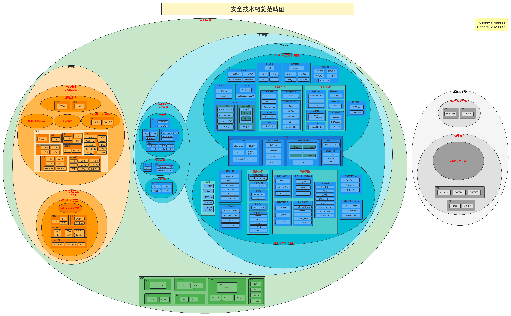

# 安全概览

## 背景

先说说写这个教程的背景：

* 之前已写过 安卓安全和破解 的教程
  * https://github.com/crifan/android_app_security_crack
    * 目前点赞不少：`600+`个star
      * 看来大家比较关注这个领域
* 自己计划从事`计算机安全领域`~=`信息安全`~=`网络安全`
  * 之前：是小白，没这方面的经验
  * 现在：边自学，边总结
    * 总结到此教程（和相关子教程）中
      * 供自己和他人参考

## 信息安全技术概览

* `安全`
  * 全称：`信息安全`
  * 传统称谓：`网络安全`
  * 典型定义：安全是一门涉及计算机科学、网络技术、通信技术、密码技术、信息安全技术、应用数学、数论、信息论等多种学科的综合性科学
  * 目的：指网络系统的硬件、软件及其系统中的数据受到保护，不受偶然的或者恶意的原因而遭到破坏、更改、泄露，确保系统能连续可靠正常地运行，网络服务不中断

由于`信息安全`技术概念包含内容较多，且涉及维度较广，下面以不同维度来阐述：

* （狭义）信息安全
  * 图
    * 安全技术概览
      * 范畴图
        * 离线图片
          * 
        * 在线网页
          * 安全技术概览范畴图 | ProcessOn免费在线作图
            * https://www.processon.com/view/link/60d2fb470791297edd62f2e3
      * 脑图
        * 离线图片
          * 
        * 在线网页
          * 安全技术概览脑图 20210624 | ProcessOn免费在线作图
            * https://www.processon.com/view/link/60d3e0bb0e3e742d29cce910#map
  * 文字
    * 不同端
      * PC端 vs 移动端
        * PC端
          * 往往指的是 基于浏览器的：[Web安全](https://book.crifan.org/books/avoid_hacker_attack_web_security/website/)
        * 移动端
          * 往往指的是 不同系统和设备的
            * [Android安全](http://book.crifan.org/books/android_app_security_crack/website)
            * [iOS安全](https://book.crifan.org/books/prevent_iphone_hacked_ios_security/website/)
      * 不同类型设备
        * PC端
          * 统称：`计算机安全`=`PC安全`
          * 侧重浏览器、网站等的：**Web安全**
            * 主要攻防方式
              * 攻
                * **渗透攻击**
              * 防
                * [渗透测试](https://book.crifan.org/books/infiltrate_your_net_penetration_testing/website/)
                * **模糊测试**
                * **代码审计**
                * [安全分析](https://book.crifan.org/books/grasp_hacker_track_security_analysis/website/)
                  * **安全日志分析**
          * 二进制方面的：[二进制安全](https://book.crifan.org/books/explore_underlying_mechanism_binary_security/website/)
            * Windows
              * **Windows漏洞挖掘**
            * Linux
              * 注：很少有此专门的方向
            * Mac
              * 注：很少有此专门的方向
        * 移动端 = 联网设备方面
          * 相对更广泛的概念：物联网
            * **物联网安全** ~= **工控安全**
          * 侧重某些领域
            * （更接近普通用户的）手机领域：**移动安全**
              * **Android安全**
              * **iOS安全**
            * 工控领域
              * [工控安全](https://book.crifan.org/books/industrial_control_security_overview/website/)
            * 汽车领域
              * [汽车安全](https://book.crifan.org/books/guard_your_car_safety/website/)
            * 无线（设备）领域
              * **无线安全**
                * WiFi领域
                  * **WiFi安全**
    * 不同层
      * 上层=Web领域：**Web安全**
      * 底层=内部机制：**二进制安全**
        * Windows的二进制安全
          * **Windows漏洞挖掘**
    * 各个子方向概述
      * 安全概述
        * 概念：红方/蓝方、逆向、靶场、蜜罐、漏洞编号、代码审计、日志清理
        * 标准：等级保护、ISO27001
        * 编号：CVE、CNCVE、CNVD
        * 组织：OWASP
        * 比赛：CTF
        * 论坛：看雪、FreeBuf
        * 子领域
          * 存储安全：指纹、虹膜、PIN码、DRM、TrustZone、OP-TEE
          * 密码破解
            * 工具：John the Ripper、Hashcat、Hydra
      * **Web安全**
        * 概念：POC、APT、DDOS、蠕虫、木马、提权、EDR、CSP、Same-Site Cookies、网络劫持、端口扫描、痕迹清理
        * 手段：社工、钓鱼
        * 证书：CISP、CISSP、CISM、CCSRP、CISAW、CISA
        * 系统：Kali
        * 工具和系统：防火墙、WAF、IDS、IPS
      * **渗透测试**
        * 概念：模糊测试、后渗透、测试报告、端口扫描
        * 标准：PTES
        * 手段：XSS、CSRF、文件包含、文件上传、XXE、SQL注入、RCE、SSRF、CORS、越权、struts2漏洞
        * 工具：Metasploit、AppScan、AWVS、BurpSuite、CobaltStrike、Nessus、ZAP、Wikto、nmap、Zenmap、Layer、Sqlmap、Commix、PEACH、Sulley、AutoDafe
      * **代码审计**
        * 工具：CxEnterprise、Armorize CodeSecue、Fortify、RIPS
      * **安全分析** ~= **安全日志分析**
        * 概念：深度包检测(DPI)、态势感知、攻击溯源、网络流量分析、网络扫描、网络取证、流量分析、日志分析、威胁建模分析、安全日志分析、日志关联分析
        * 网络工具：Wireshark、NetworkMiner、Capsa Free、Zenoss Core、The Dude、Angry IP Scanner、
        * 日志处理：ELK、Splunk
      * **二进制安全**
        * 概念：PWN、X86、ARM、汇编、加壳、漏洞挖掘、堆和栈、栈溢出、堆溢出、缓冲区溢出、漏洞分析、漏洞挖掘、病毒分析
      * **Windows漏洞挖掘**
        * 概念：VMProtect、Windows漏洞分析、Windows漏洞挖掘
        * 机制：ASLR、CFG、DEP、GS、SafeSEH、SEHOP、缓冲区溢出、ROP、Heap spray、Shellcode
        * 工具：WinDGB、OllyDBG、IDA、radare2、Hex-rays、dnSpy、Capstone、winchecksec、PEID、EXEinfo PE、Detect It Easy、PEiD、Cheat Engine、MHS、ModifyMemory
      * **移动安全**
        * 概念：代码混淆、代码反混淆、花指令、加壳/加固、去壳/脱壳/砸壳、反调试
      * **Android安全**
        * 概念：反编译、Dalvik、apk、dex、jar、NDK、OLLVM混淆、VMP、Smali/Baksmali、VirtualApp、DroidPlugin、JNI
        * 防护：ProGuard、dep保护、so保护
        * 加固公司：360加固、腾讯乐固legu、爱加密、梆梆安全、顶象安全、几维安全
        * 工具：Apktool、dex2jar、JEB、Xposed、Cydia、Frida、IDA、apkbuilder、FDex2、jadx、DumpDex、Nox夜神模拟器、dex2jar、procyon、CFR、JD-GUI、Luyten、GDA、AndBug、010editor、APK Analyzer、Androguard
      * **iOS安全**
        * 概念：iOS系统安全、mach格式、沙盒、代码签名、越狱
        * 工具：GDB、Hopper Disassembler、LLLVM、LDB、Obfuscator-LLVM、Miasm、lldb-server、radare2、Cutter、ios-class-guard、debugserver、MonkeyDev、class-dump、MachOView、otool、jtool、bfinject、Clutch、Dumpdecrypted、frida-ios-dump、Cydia Substrate、frida、Electra、unc0ver
      * **物联网安全** ~= **工控安全**
        * 安全事件：BlackEnergy
        * 概念：PLC、SCADA、HMI、MTU、RTU、NSE脚本、通信劫持、ATT&CK、固件提取&分析
        * 工控协议：ATG、Modbus、Siemens S7、IEC 104、OPC、PROFIBUS、Profinet、mqtt、zigbee
        * 平台：Shodan、Censys、ZoomEye、FOFA、Diting
        * 固件工具：binwalk、AttifyOS、eimgfs
        * 工控操作系统：Linux、WinCE、FreeRTOS、VxWorks
        * 工控行业：先进制造、电力、轨交、石油石化、烟草、金属钢铁
      * **汽车安全**
        * 技术：V2X
        * 标准： UNECE WP.29、ISO/SAE 21434
      * **无线安全**
        * 无线协议：WiFi、蓝牙、ZigBee、NFC
      * **WiFi安全**
        * 工具：Aircrack-ng、Wifiphisher
* （广义）信息安全
  * `信息安全`
  * 子领域=特殊领域
    * `信息存储安全`
      * 典型应用场景：指纹、虹膜、信用卡PIN码等
      * 包含
        * 硬件
          * `TrustZone`
        * 软件
          * `OP-TEE`
    * `功能安全`

## 安全相关的人

* 安全领域
  * 人
    * 坏人
      * 黑帽子
        * `黑客`=`hacker`
          * 源于：英文单词`hack`
            * `hack`：原意为`劈`、`砍`
          * `黑客`的本意：指一些计算机水平很高的程序员，他们可以发现系统中潜在的漏洞，彼此之间经常在计算机网络中相互交换安全信息和安全技术，但从来不对别人的计算机系统进行蓄意破坏
          * 早期历史
            * 在20世纪50年代初期成为麻省理工学院（MIT）学生的俚语，有`恶作剧`之意，尤其指手法巧妙，技术高明的恶作剧，并且带有反既有体制的色彩
            * 黑客最早开始于MIT，是一群在贝尔实验室里专门钻研高级计算机技术的人
            * 黑客们通过黑客这种手段向自己的目标奋斗着：60年代他们反对技术垄断，70年代提出电脑应该为民所用，80年代他们又提出信息共享，可以说今天的全球信息化他们也有一份功劳。
          * 后来的演化
            * 但到了90年代，事情开始变了，技术不再是少数人的专有权力，越来越多的人都掌握了这些，导致了黑客的概念与行为都发生了很大的变化
            * 现在的黑客已经成了利用技术手段进入其权限以外的计算机系统的人，人们对他们已不再是以往的崇拜，更多的是畏惧和批评。从某个角度来说，现在网络上的大多数黑客其实根本不配用`黑客`这个名称。
        * `骇客`=`cracker`
          * 评价：骇客正是把网络搞的乌烟瘴气的罪魁祸首
          * 定义：利用现有的一些程序进入别人的计算机系统后发现安全漏洞，并且利用这些漏洞破坏你的网站，让你出洋相
            * 还有那些专门破译软件密码的从而制作盗版软件的人也是骇客的一种
            * 骇客们大多也只不过是为了炫耀自己的技术，大多数人并没有恶意，未必具有很高的技术，但其中还是不乏一些用心险恶之人，利用自己的技术进行网络犯罪
    * 好人
      * 白帽子
        * 与`黑帽子`形象的`黑客`对应，从事正向的用于防护的安全领域
      * `红帽子` = `红客`
        * 红客则说是中国黑客起的名字，指那些维护国家利益，不去利用网络技术入侵自己国家电脑，而是维护正义，为捍卫中国的主权而战的黑客们
