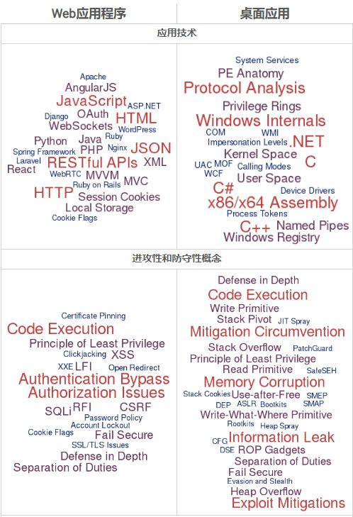

# 安全概览

## 背景

先说说写这个教程的背景：

* 之前已写过 安卓安全和破解 的教程
    * https://github.com/crifan/android_app_security_crack
      * 目前点赞不少：`600+`个star
        * 看来大家比较关注这个领域
* 自己计划从事`计算机安全领域`~=`信息安全`~=`网络安全`
  * 之前是小白，没这方面的经验
  * 打算边自学，边总结
    * 总结到此教程（和相关子教程）中
      * 供自己和他人参考

## 信息安全技术概览

信息安全技术概念包含内容较多，且涉及维度较广，下面以不同维度来阐述，常见分类和对应内容。

* 信息安全
  * 概述
    * 
  * 根据不同`端`=`目标`=`设备` 或 `侧重点`=`方向` 分
    * 远程 -> `Web端`：`网络安全`=`Web安全`=`互联网安全`
      * `渗透测试`
        * 不同角度
          * 攻：`渗透攻击`
          * 防：`渗透测试`
        * 详见：[潜入你的网络：渗透测试](https://book.crifan.com/books/infiltrate_your_net_penetration_testing/website/)
        * 相关
          * `模糊测试`
          * `端口扫描`
    * 本地=本机 -> `设备端`
      * `PC端`=`桌面端`：`计算机安全`
        * 包含
          * `Windows`
            * 往往指的是：`二进制安全` ~= `PWN`
              * 详见：[探究底层机制：二进制安全](https://book.crifan.com/books/explore_underlying_mechanism_binary_security/website/)
          * `Linux`
          * `Mac`
      * `移动端`：`移动安全`
        * 包含
          * `Android`
            * 详见：[安卓安全和破解](http://book.crifan.com/books/android_app_security_crack/website)
          * `iOS`
            * 详见：[防止iPhone被黑：iOS安全](https://book.crifan.com/books/prevent_iphone_hacked_ios_security/website/)
              * 往往涉及到，在`Mac`和`Linux`中运行相关安全和破解的工具
                * -> 所以也就包含了`Mac`和`Linux`相关安全内容
      * `IoT端`：`物联网安全` ~= `工控安全`
        * 详见：[工控安全概览](https://book.crifan.com/books/industrial_control_security_overview/website/)
      * 其他特定设备
        * `WiFi安全`
  * Web vs 二级制
    * Web`网络`
      * `渗透测试`
    * 本机的`二级制`=`PWN`
      * 方向
        * 漏洞
          * `漏洞分析`
          * `漏洞挖掘`
        * 病毒
          * `病毒分析`
      * 系统
        * Windows
          * `Windows漏洞分析`
          * `Windows漏洞挖掘`
  * 根据攻防角度不同
    * 攻=攻击
      * `渗透攻击`
        * 对应：防 的`渗透测试`
    * 防=防护=预防=防患于未然
      * 功能角度
        * `安全开发`=`安全功能开发`
      * 搞清楚情况
        * 角度
          * 是否被攻击？
          * 谁攻击的？
        * 手段
          * `安全分析`
            * 不同数据源
              * 日志 -> `安全日志分析`
              * （路由器、防火墙等）数据包 -> `深度包检测`=`DPI`
            * 输出结果
              * `态势感知`
              * `攻击溯源`
            * 详见：[掌握黑客的行踪：安全分析](https://book.crifan.com/books/grasp_hacker_track_security_analysis/website/)
      * 代码 -> 防止代码中出现漏洞或弱点
        * `代码审计`=`代码审查`
          * 用`代码审查工具`审查代码，找出漏洞，并修复
  * 广义的信息安全
    * 子领域=特殊领域
      * `信息存储安全`
        * 典型应用场景：指纹、虹膜、信用卡PIN码等
        * 包含
          * 硬件
            * `TrustZone`
          * 软件
            * `OP-TEE`
